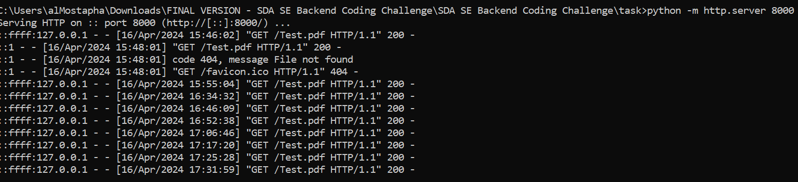

## I will call this small service: IBAN Watchtower

Iban WatchTower is a Java-based application designed to integrate with Kafka for the purpose of scanning documents for blacklisted International Bank Account Numbers (IBANs). This application consumes document check tasks from a Kafka topic, processes PDF documents specified in the messages, and evaluates them against a list of blacklisted IBANs.

## Features
- ### Document Fetching: 
Downloads PDF documents from URLs provided via Kafka messages.
- ### IBAN Scanning: 
Scans documents for IBANs and checks against a predefined list of blacklisted numbers.
- ### Kafka Integration: 
Utilizes Kafka for both consuming document check tasks and producing scan results.

## Prerequisites
- Java 17
- Apache Kafka
- Any PDF handling library (e.g., Apache PDFBox, used here for extracting text from PDFs)
- Spring Boot (for ease of setup and Kafka integration)
Installation and Setup.

## Kafka Setup
To run the Kafka broker first, I had an idea that you can use, move to the directory where Kafka is installed and then to `\bin\windows`, 
create this file: `start-kafka.bat` that has this content (for me igt was something like this, I am using jdk-17):
```text
set JAVA_HOME=%ProgramFiles%\Java\jdk-17
start C:\kafka_2.13-3.7.0\bin\windows\zookeeper-server-start.bat C:\kafka_2.13-3.7.0\config\zookeeper.properties
 
TIMEOUT 10
 
start C:\kafka_2.13-3.7.0\bin\windows\kafka-server-start.bat C:\kafka_2.13-3.7.0\config\server.properties
```
Then, open the CMD and run this command line as Admin:
```bash
.\start-kafka.bat
```

After ensuring that Kafka is running on your system, create the necessary Kafka topics:

```bash
.\kafka-topics.bat --create --topic checkEvents --partitions 1 --replication-factor 1 --bootstrap-server localhost:9092
.\kafka-topics.bat --create --topic checkResultEvents --partitions 1 --replication-facto
```

To check if your topics were already created, you can run this command line:


Since our service expects a URL to fetch the PDF from, we'll need to host our PDF file somewhere accessible. 
We could use any simple HTTP server on our local machine (like using Python's HTTP server module) or an online free file hosting service that doesn't require authentication.

Therefore, if using Python's HTTP server, navigate to the directory where your PDF is stored and run:
```bash
python -m http.server 8000
```


This will serve files on http://localhost:8000/. 
The PDF would be accessible via http://localhost:8000/Test.pdf (just renamed it from: `Testdaten_Rechnungseinreichung` to `Test`) as you can see here for me:


Start your Malware Scanner or Iban WatchTower application after ensure it's configured to connect to the local Kafka instance, 
you will see something like this:


## Start a Console Producer:


Then you need to type a simulated check event JSON into the console (like shown in the screenshot):
```json
{"url": "http://localhost:8000/Test.pdf", "fileType": "pdf"}
```

## Start a Console Consumer:

To listen to the output topic and see if the application processes the input correctly 
and produces the expected results (will show results after some Iban examples):

#### Examples of Ibans that can be used:

- For example this Iban is already in th Test.pdf, which means that the ``checkResultEvents`` corresponding event should have the **SUSPICIOUS** state:


- Otherwise, it should show **OK** state, for example these:


- And then results are as expected .

Here are logs from the Application after that:


